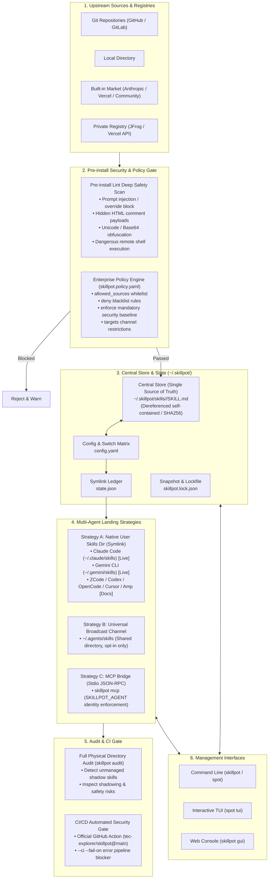

# SkillPot

[](LICENSE)
[](https://www.npmjs.com/package/@tec-explorer/skillpot)
[](package.json)

**Cross-agent skill supply chain security & governance layer for coding agents — install once, expose per target, pre-install safety gate, full audit.**

> Coding agents (Claude Code, ZCode, Codex, OpenCode, Gemini CLI, Cursor, Amp…) have converged on the same `SKILL.md` open standard, but face dual challenges: **supply chain security risks** (prompt injection, concealed payloads, unmanaged shadow skills) and **fragmented discovery paths**. SkillPot serves as a security and governance layer: blocking high-risk injections before disk write, offering full physical directory audits with CI gating, granular per-target exposure, and publishing an **honest, per-agent live verification matrix**.

[中文文档](README.md) ｜ 📖 [Feature guide with screenshots](docs/guide.md)


## Why SkillPot

Registries and marketplaces (skills.sh, Anthropic marketplace) answer *"where do I find skills"* — they are the **upstream distribution**. SkillPot provides the **supply chain security & governance layer**:

- **Pre-install security gate**: Deep scans `SKILL.md` bodies for prompt injection, hidden HTML comment payloads, Unicode zero-width obfuscation, Base64 execution, and dynamic remote pipe fetches (`curl | sh`). Blocks on `error` before saving to disk unless forced (`-f`).
- **Full directory audit & CI gate**: `skillpot audit` scans physical directories across all agents to detect unmanaged shadow skills bypassing SkillPot, and supports `--ci --fail-on <level>` with non-zero exit codes to guard deployment pipelines.
- **Honest per-agent verification matrix**: Rejects unverified marketing claims. Publishes concrete verification evidence, specifications, and probe verification scripts for 8 agents + 1 broadcast channel.
- **One central store** at `~/.skillpot/skills/` — a single source of truth with sha256 checksums and lockfile.
- **Per-target switch matrix** — `config.yaml` drives a symlink sync engine; flip switches in the Web GUI, interactive TUI, or CLI.
- **Universal broadcast column** (`~/.agents/skills/`) — treated as a first-class target (`broadcast`), requiring explicit opt-in (never polluted by `--for all`).
- **Doctor**: Broken links, drift, shadowed names, orphaned links — `--fix` repairs automatically.
- **Team alignment**: Commit a `.skillpot.yaml` manifest; teammates run `skillpot sync` to achieve deterministic configuration across machines.
- **In-place updates & diff**: Git-sourced skills update in place with file-level diff output; symlinks stay valid without relinking.
- **Adopt existing skills**: One-click migration of pre-existing skills across agent directories (copy or move mode).
- **MCP bridge**: Any MCP-capable agent can consume the central store, constrained by `SKILLPOT_AGENT` identity and matrix policies.
- **Enterprise policy & private registry**: Declare organizational policy in `skillpot.policy.yaml` (enforce baseline skills, deny blacklist patterns, source whitelisting, and JFrog / Vercel private registry token integration with `--ci` gate).
- **Crash- and race-safe state**: Atomic writes (temp file + rename) and an inter-process file lock around every state modification.

## Quick start

Requires Node ≥ 18.

```bash
npm install -g @tec-explorer/skillpot          # npm registry install (alias: spot)
brew tap tec-explorer/tap && brew install skillpot # Homebrew install (macOS / Linux)
npx @tec-explorer/skillpot                     # run without installing

skillpot init                     # create ~/.skillpot and detect installed agents
skillpot adopt --dry-run          # preview: existing skills found in agent dirs
skillpot adopt --move             # adopt with move mode (original dir becomes a symlink)
skillpot gui                      # web console: matrix / doctor / adopt / install / market / maintain / team
skillpot add ~/demo/my-skill      # install a skill (exposed to no target by default)
skillpot enable my-skill --for claude-code,codex
skillpot enable my-skill --for broadcast   # universal broadcast into ~/.agents/skills
skillpot doctor                   # consistency check (--fix to repair)
skillpot search "commit message"  # search the skills.sh directory
skillpot install-search anthropics/skills/pdf   # install a directory result
skillpot sync                     # align with a project .skillpot.yaml manifest
skillpot policy check             # verify organizational policy compliance
skillpot registry                 # show private registry and token status
```

> Agents scan their skill directories at session start — restart a session after enable/disable.
> `--for all` expands to every concrete agent and **excludes the broadcast column** — broadcasting is opt-in only.

## How it works & Architecture



```
~/.skillpot/
├── skills/<name>/SKILL.md   # central store: the single copy (self-contained, symlinks dereferenced)
├── config.yaml              # sources / checksums + the skill × target switch matrix
├── state.json               # ledger of links this tool created (uninstall only touches these)
├── skillpot.lock.json       # machine-readable snapshot (team sharing / audit)
└── cache/market/            # clone cache for market sources
```

`enable` creates a symlink from the target directory into the central store — agents discover it on their next session scan. `disable` removes it. The tool only ever touches paths recorded in its own ledger.

Matrix columns come in two kinds: concrete **agents** (`claude-code`, `codex`, …) and the **universal broadcast** channel (`broadcast` → `~/.agents/skills/`). The channel is coarse-grained — every agent honouring that convention sees it and it cannot be switched off per agent — so it is never implied by `--for all`.

Landing strategies per agent: **A** symlink (default) → **B** copy + resync (agents that don't follow symlinks) → **C** MCP bridge (universal fallback).

## Per-Agent Verification Matrix

> Rejects marketing claims without evidence. SkillPot publishes each agent's specification source, discovery path, verified status, and automated probe commands.

| Target ID | Agent / Channel | Kind | User-level Discovery Path | Level | Specification Basis & Verification Evidence |
|---|---|---|---|---|---|
| `claude-code` | **Claude Code** | Agent | `~/.claude/skills` | **Live** `live` | Anthropic Agent Skills standard originator; live verified with `claude -p` and interactive sessions |
| `gemini-cli` | **Gemini CLI / Antigravity** | Agent | `~/.gemini/skills` | **Live** `live` | Google Customization System; progressive disclosure of `SKILL.md`, verified via live probe |
| `zcode` | **ZCode** | Agent | `~/.zcode/skills` | **Docs** `docs` | Official configuration guide confirms user-level path and priority; also consumes `~/.agents/skills` |
| `codex` | **Codex CLI** | Agent | `~/.codex/skills` | **Docs** `docs` | Official `.system` sample confirms full `SKILL.md` adherence; workspace reads `.codex/prompts` |
| `opencode` | **OpenCode** | Agent | `~/.config/opencode/skill` | **Docs** `docs` | Official docs define singular `skill/` path, 100% compatible with Anthropic SKILL.md format |
| `cursor` | **Cursor** | Agent | `~/.cursor/skills` | **Docs** `docs` | Official docs & `create-skill` rules confirm user-level and project-level directories |
| `amp` | **Amp** | Agent | `~/.config/amp/skills` | **Docs** `docs` | Official skill announcement confirms concurrent multi-path scanning (user & workspace) |
| `dsh` | **DeepSeek CLI** | Agent | `~/.dsh/skills` | **Unverified** `unverified` | Directory aligned with Claude, but 0.1.2 runtime dynamic scanning pending final confirmation |
| `broadcast` | **Universal Broadcast** | Channel | `~/.agents/skills` | **Docs** `docs` | Cross-tool shared convention (native to Vercel `skills` CLI, ZCode, Antigravity, Amp) |

- **Verification Criteria**: Based solely on whether the agent discovers symlinks created by SkillPot:
  - **Live (`live`)**: Confirmed via live probe command or interactive session.
  - **Docs (`docs`)**: Official docs/plugins confirm path and format; live symlink discovery pending machine record.
  - **Unverified (`unverified`)**: Convention emerging or dynamic loader under development.
- **Automated Probe Tool**: Built-in [`scripts/verify-probe.sh`](./scripts/verify-probe.sh). Run `bash scripts/verify-probe.sh <agent-id>` to test and verify symlink discovery on any machine.
- Detailed dossier and shadowing rules: [docs/design/verification-matrix.md](./docs/design/verification-matrix.md) and [docs/design/agent-adapters.md](./docs/design/agent-adapters.md).

## GitHub Action (CI Security Gate)

Add automated supply-chain security gating into your repository's pull requests:

```yaml
- name: Run SkillPot Security Gate
  uses: tec-explorer/skillpot@main
  with:
    args: 'audit --ci --fail-on error'
```

Supports organizational policy enforcement (`policy check --ci`) and private registry token integration. See [docs/ecosystem/github-action.md](docs/ecosystem/github-action.md).

## Documentation

- [Feature guide (screenshots)](docs/guide.md) — Chinese, with screenshots of every surface
- [Design: agent adapters](docs/design/agent-adapters.md) · [Design: MCP bridge](docs/design/mcp-bridge.md) · [Design: Enterprise policy](docs/design/enterprise-policy.md) · [GitHub Action](docs/ecosystem/github-action.md) · [Homebrew Tap](docs/ecosystem/homebrew.md) · [Product plan](docs/product/product-plan.md)

## Security

Skills are instructions injected into model context plus optionally executable scripts. SkillPot's defaults:

- **Pre-install security block**: deep scans `SKILL.md` body (prompt injection, hidden HTML comment payloads, Unicode zero-width obfuscation, Base64 exec, dynamic remote fetch) and lifecycle hooks; blocks on `error` before saving to disk unless `--force` (`-f`) is given.
- **Full audit & CI gate**: `audit` scans all physical files across agent directories for unmanaged skills; supports `--ci` / `--fail-on <level>` with non-zero exit code as CI gates.
- Install lints before exposing; nothing is exposed to any target until you say so.
- Uninstall/disable only touches ledgered paths.
- Web console listens on 127.0.0.1 with token-gated writes.

Two defaults worth knowing about:

- The **universal broadcast column is excluded from `--for all`** — it writes into the cross-tool shared directory, so it can never be undone per agent. The TUI skips that column in its row-wide toggle and the GUI asks for confirmation before bulk-enabling it.
- The **MCP bridge fixes agent identity via the `SKILLPOT_AGENT` env var**; a `tools/call` argument cannot widen what `list`, `search`, or `read` can see.

Report vulnerabilities via [SECURITY.md](SECURITY.md).


## Development

```bash
npm install
npm test          # vitest, sandboxed (never touches your real HOME)
npm run test:e2e  # sandboxed end-to-end smoke
npm run build     # typecheck + esbuild bundle + web GUI build
```

## License

[MIT](LICENSE)
