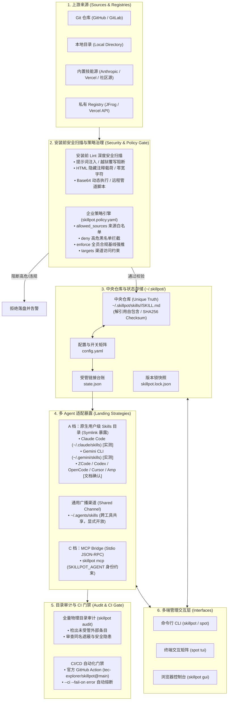

# SkillPot

[](LICENSE)
[](package.json)
[](https://github.com/tec-explorer/skillpot/actions)
[](https://www.npmjs.com/package/@tec-explorer/skillpot)
[](https://www.npmjs.com/package/@tec-explorer/skillpot)

**面向编程 Agent 的 Skill 供应链安全与跨工具治理层 —— 一处安装，按 Agent 粒度开关，安装即阻断恶意注入，全量目录审计与 CI 门禁。**
*Cross-agent skill supply chain security & governance layer for coding agents — install once, expose per target, pre-install safety gate, full audit.*

[English](README.en.md) ｜ 中文

> 编程 Agent（Claude Code、ZCode、Codex、OpenCode、Gemini CLI、Cursor、Amp…）已收敛到同一套 `SKILL.md` 开放标准，但面临**供应链安全风险**（提示词注入、恶意载荷、未受管外部 skill 绕过）与**发现路径割裂**双重挑战。SkillPot 构筑安全治理防线：文件落盘前深度阻断高危注入，全量物理目录审计与 CI 门禁，按目标精确开关，并公开**逐家实机验证证据表**。


📖 **[功能指南(含 TUI/GUI 全功能截图与说明)](docs/guide.md)**

## 特性

- **安装前安全扫描与默认阻断**：在文件落盘前深度扫描 `SKILL.md` 正文（提示词注入、隐藏 HTML 注释载荷、零宽字符混淆、Base64 动态执行、远程管道执行）与生命周期钩子，发现高危风险直接拒绝安装，可 `-f/--force` 强制放行
- **全量物理目录审计与 CI 门禁**：`audit` 全量扫描各 Agent 物理目录，检出绕过 SkillPot 写入的未受管外部 skill 并审查安全隐患；支持 `--ci --fail-on <level>` 作为持续集成自动化门禁
- **逐家实机验证证据表**：拒绝“虚标支持”，公开 8 家 Agent + 1 渠道的规范依据、发现路径、验证等级（实测 / 文档确认 / 未验证）与自动化探针脚本
- **按目标精确开关**：`config.yaml` 驱动的 skill × 目标矩阵 + 软链接同步引擎；支持 TUI 矩阵可视化操作与 `skillpot gui` Web 控制台
- **通用广播一等列**：跨工具共享目录 `~/.agents/skills` 作为一等矩阵列（`broadcast`），与各 Agent 列并列显式开放，绝不隐式污染
- **一处安装与中央仓库**：中央仓库 `~/.skillpot/skills/` 存唯一真身，自包含解除嵌套依赖，自带 sha256 checksum 与版本锁
- **团队配置一键对齐**：通过项目级 `.skillpot.yaml` 清单，团队成员执行 `skillpot sync` 即可实现全员 skill 与版本一致性
- **一处更新与版本 diff**：git 来源 skill 原位更新，提供文件级变更差异对比，软链接无需重新绑定
- **收编（adopt）**：一键迁移散落在各 Agent 目录里的既有 skill，提供拷贝与移动（symlink 替换）双模式
- **MCP bridge**：任何支持 MCP 的 Agent 均可通过 stdio bridge 消费中央仓库，受 `SKILLPOT_AGENT` 身份环境变量与矩阵严格约束
- **doctor 状态体检**：断链 / 漂移 / 同名遮蔽 / 孤儿链接全面体检，`--fix` 自动修复
- **高并发原子写入与互斥锁**：临时文件写入 + rename 原子替换，跨进程文件互斥锁保证并发 `enable/disable` 状态一致性

## 工作原理与全景架构



```
~/.skillpot/
├── skills/<name>/SKILL.md   # 中央仓库：唯一真身（自包含，symlink 已解引用）
├── config.yaml              # 来源/版本/校验和 + skill×目标 开关矩阵
├── state.json               # 本工具创建的链接台账（卸载只动台账内文件）
├── skillpot.lock.json       # 机器可读快照（团队共享/审计用）
└── cache/market/            # 市场源克隆缓存（浅克隆，「刷新」强制更新）
```

`enable` 在目标目录创建指向中央仓库的 **symlink**（Agent 启动扫描目录时即被发现）；`disable` 撤下该 symlink。只动台账内的链接，绝不碰用户自建内容；遇到真实同名目录一律跳过并告警。矩阵的列有两类：具体 Agent（`claude-code`、`codex`…）与**通用广播**渠道（`broadcast` → `~/.agents/skills`），后者对所有支持该约定的 Agent 可见、无法按 Agent 单独关闭，因此需显式开放、不含在 `--for all` 中。

## 快速开始

要求 Node ≥ 18。

**安装 skillpot 本体**（多种安装方式）：

```bash
npm install -g @tec-explorer/skillpot          # npm registry 安装（短别名 spot）
brew tap tec-explorer/tap && brew install skillpot # Homebrew 安装 (macOS / Linux)
npx @tec-explorer/skillpot                     # 免安装直接运行
npm install -g github:tec-explorer/skillpot    # GitHub 源码直装
```

**常用命令**：

```bash
skillpot init                        # 初始化 ~/.skillpot 并检测本机 Agent
                                     # （仓库为空时会扫描各 Agent 已有 skill，交互询问是否移入）
skillpot adopt --dry-run             # 预览：各 Agent 目录下有哪些 skill 可收编
skillpot adopt --move                # 收编并以移动模式部署（原目录替换为 symlink）
spot tui                             # 交互式开关矩阵：↑↓←→ 移动，空格切换，a 整行
skillpot gui                         # 浏览器控制台：开关矩阵/体检/收编/安装/市场/维护
skillpot market                      # 浏览技能源（内置 Anthropic 官方库，可加自定义源）
skillpot add ~/path/to/my-skill      # 安装新 skill（默认不对任何 Agent 开放）
skillpot enable my-skill --for claude-code,zcode
skillpot enable my-skill --for broadcast   # 通用广播：放进 ~/.agents/skills（粗粒度）
skillpot doctor                      # 体检：断链/漂移/同名冲突
```

> Agent 在会话启动时扫描 skill 目录，enable/disable 后重启示例会话生效。
> `--for all` 展开为**全部具体 Agent**，不含通用广播列——广播只该显式开放。

**安装 skill 来源**：`skillpot add https://github.com/owner/skills.git#subdir`（浅克隆，`#` 后定位子目录；也支持 `file://` 本地仓库）。

**从源码运行**（开发模式）：clone 后 `npm install`（自动构建），再 `npm link` 即可全局使用 `skillpot`。

## 命令

| 命令 | 说明 |
|---|---|
| `init` | 初始化中央仓库 + Agent 检测（空仓库时触发收编提醒） |
| `agents [--json]` | 检测本机编程 Agent（PATH 二进制 + 配置目录指纹）与各目标验证等级 |
| `add <dir\|git[#subdir]> [-n 名字] [-f]` | 安装 skill（安装前安全 lint 默认阻断，`-f` 强制放行） |
| `list [-a agent\|broadcast]` | 已装 skill 清单与开放状态 / 某目标的可见列表 |
| `enable <skill> -f a,b\|all` | 开放（建 symlink）；`broadcast` 为通用广播列，`all` 不含它 |
| `disable <skill> -f a,b\|all` | 关闭（撤 symlink） |
| `adopt [--from agents] [-f agents] [--move] [--dry-run]` | 收编已有 skill；`--move` 移动模式 |
| `remove <skill>` | 卸载（撤下所有链接 + 删除文件） |
| `doctor [--fix]` | 体检与自动修复 |
| `audit [--json] [--ci] [--fail-on <level>]` | 审计：全量实际生效/未受管 skill、来源、安全隐患与 CI 门禁 |
| `lint [skill] [--strict]` | 安全与质量检查：正文提示词注入、隐藏注释、Unicode 混淆、脚本高危模式 |
| `update [skill] [--check]` | 检查/应用 git 来源 skill 的更新 |
| `gui [--port] [--host] [--no-open]` | Web 控制台：开关矩阵/体检/收编/安装/市场/维护 |
| `market [url] [--refresh]` | 浏览技能源里的 skill（缺省扫描全部源） |
| `sync [--file] [--export] [--dry-run]` | 团队对齐：按项目清单 `.skillpot.yaml` 安装/对齐 skill |
| `policy [check\|apply\|init]` | 企业级策略治理：合规基线、黑白名单阻断与自动修复（Policy-as-Code） |
| `registry` | 查看私有/公共 Registry 连接状态与认证信息 |
| `source list\|add <url>\|remove <url>` | 市场源管理（内置官方源 + 自定义 git 源） |
| `mcp` | 以 MCP server (stdio) 运行，供支持 MCP 的 Agent 消费 |
| `tui [--once]` | 交互式开关矩阵；无 TTY 自动降级静态输出 |

## 逐家验证证据表（Verification Matrix）

> 拒绝竞品式“宣称支持 N 家却无证据、频繁静默失效”。SkillPot 公开每一家 Agent 的规范来源、发现路径、验证等级与实机探针测试方法。

| 目标标识 | Agent / 渠道 | 类型 | 用户级发现路径 | 验证等级 | 规范依据与验证证据 |
|---|---|---|---|---|---|
| `claude-code` | **Claude Code** | Agent | `~/.claude/skills` | **实测** `live` | Anthropic 官方 Agent Skills 标准；M0 实机探针经 `claude -p` 与交互会话确认生效 |
| `gemini-cli` | **Gemini CLI / Antigravity** | Agent | `~/.gemini/skills` | **实测** `live` | Google 官方 Customization 规范；渐进式加载 `SKILL.md`，实机探针确认生效 |
| `zcode` | **ZCode** | Agent | `~/.zcode/skills` | **文档确认** `docs` | 官方配置指南确认用户级路径与优先级；同时支持 `~/.agents/skills` 广播目录 |
| `codex` | **Codex CLI** | Agent | `~/.codex/skills` | **文档确认** `docs` | 官方内置 `.system` 样例确认遵从 `SKILL.md` 标准；项目另读 `.codex/prompts` |
| `opencode` | **OpenCode** | Agent | `~/.config/opencode/skill` | **文档确认** `docs` | 官方文档公开约定为单数 `skill/` 目录，完全兼容 Anthropic SKILL.md 格式 |
| `cursor` | **Cursor** | Agent | `~/.cursor/skills` | **文档确认** `docs` | 官方文档与 `create-skill` 规则规范确认用户级与项目级目录约定 |
| `amp` | **Amp** | Agent | `~/.config/amp/skills` | **文档确认** `docs` | 官方技能规范公告确认用户级与项目级目录多路并发扫描 |
| `dsh` | **DeepSeek CLI** | Agent | `~/.dsh/skills` | **未验证** `unverified` | 目录结构与 Anthropic 对齐，但 0.1.2 运行时尚未完全收口动态扫描，纳管为前瞻性约定 |
| `broadcast` | **通用广播（跨工具共享）** | 渠道 | `~/.agents/skills` | **文档确认** `docs` | 跨工具共享开放规范（Vercel `skills` CLI、ZCode、Antigravity、Amp 原生读取） |

- **验证等级口径**以“该 Agent 能否发现 SkillPot 建立的链接”为唯一基准：
  - **实测 (`live`)**：真机通过探针或真实会话确认能发现并触发链接；
  - **文档确认 (`docs`)**：路径与格式有官方公开文档/插件明确支持，软链接发现待实机进一步打卡；
  - **未验证 (`unverified`)**：路径或动态加载逻辑仍在演进中，纳管为前瞻性约定。
- **自动化实机探针工具**：项目内置 [`scripts/verify-probe.sh`](./scripts/verify-probe.sh)，开发者可在安装对应 Agent 后执行 `bash scripts/verify-probe.sh <agent-id>` 进行自检与实测打卡。
- 完整技术全案、遮蔽优先级与复现方法见 [docs/design/verification-matrix.md](./docs/design/verification-matrix.md) 与 [docs/design/agent-adapters.md](./docs/design/agent-adapters.md)。

其他支持 MCP 的 Agent（Qoder、私有 harness…）可走 [MCP bridge](#mcp-bridgec-档兜底)。新增适配器方法见 [docs/design/agent-adapters.md](./docs/design/agent-adapters.md)。

## MCP bridge（C 档兜底）

无原生 skills 目录的 Agent 可通过 MCP 消费中央仓库：把 `skillpot mcp`（stdio）注册为其 MCP server，即获得 `skillpot_list / skillpot_read / skillpot_search` 三个工具。

**在 Agent 的 MCP 配置里声明身份**是推荐做法：

```jsonc
{ "command": "skillpot", "args": ["mcp"], "env": { "SKILLPOT_AGENT": "codex" } }
```

- 声明了 `SKILLPOT_AGENT`，服务端就**以它为准**，`tools/call` 里的 `agent` 参数会被忽略——否则消费方可以自称任意 Agent 绕过矩阵；未声明时才退回用参数（兼容人工调试）。
- 三个工具都受矩阵约束：`list` 只列、`search` 只搜、`read` 只读**对当前身份开放**的 skill；`disable` 对 MCP 通道即时生效。
- 通用广播列不会自动让每个 Agent 可见：这里按 `skill × agent` 单元格判定。

设计说明见 [docs/design/mcp-bridge.md](./docs/design/mcp-bridge.md)。

## 团队协作

在项目仓库里提交一份 `.skillpot.yaml` 清单，声明项目需要哪些 skill：

```bash
cd your-project
skillpot sync --export          # 从当前中央仓库导出清单（可 --skill a,b 精选）
git add .skillpot.yaml && git commit -m "chore: pin project skills"
```

团队成员克隆仓库后一键对齐——安装缺失的、重装与版本锁不一致的、应用清单里的开放矩阵：

```bash
skillpot sync           # 按 ./.skillpot.yaml 对齐；--dry-run 先预览
```

- 清单带 `checksum` 即**版本锁**：本机实际内容偏离清单会自动重装对齐；不带则只保证已安装、不主动更新
- `local:` 来源无法跨机器对齐，导出时会给出警告
- 对齐走与 `add` 相同的安装流程（含 lint、来源登记进 lockfile）

## 企业策略治理与私有 Registry

通过维护代码化策略文件 `skillpot.policy.yaml`，组织可实现全员合规基线管控与私有 Registry 对接：

```yaml
version: 1
name: enterprise-security-baseline
mode: strict # strict（默认阻断）| audit（告警模式）

allowed_sources:
  - "git:https://github.com/my-org/*"
  - "local:*"

targets:
  broadcast:
    allow: false # 禁用全局广播暴露

enforce:
  - name: "security-guard"
    source: "git:https://github.com/my-org/security-guard.git"
    for: all # 强制开启的目标（all 或逗号分隔 Agent 列表）

deny:
  - name: "*crypto*"
    reason: "组织黑名单"

registry:
  url: "https://skills.corp.example.com/api"
  token_env: "SKILLPOT_REGISTRY_TOKEN"
  force_private: true
```

- `skillpot policy init`：生成标准企业策略模板
- `skillpot policy check [--ci]`：合规审查，未达基线或命中黑名单返回非零状态码
- `skillpot policy apply [--dry-run]`：自动修复，强制安装补齐基线并清除违规暴露
- `skillpot registry`：查看私有 Registry 连接与鉴权状态
- 详见 [docs/design/enterprise-policy.md](./docs/design/enterprise-policy.md)。

## 官方 GitHub Action (CI 门禁)

在项目的 GitHub Actions 工作流中引入安全门禁，拦截任何恶意提示词注入、隐藏载荷与违规外部技能：

```yaml
- name: Run SkillPot Security Gate
  uses: tec-explorer/skillpot@main
  with:
    args: 'audit --ci --fail-on error'
```

支持企业自定义策略门禁（`policy check --ci`）与私有 Registry Token 注入，详见 [docs/ecosystem/github-action.md](./docs/ecosystem/github-action.md)。

## 安全

Skill 是注入模型上下文的指令 + 可携带可执行脚本。SkillPot 的默认安全姿态：

- `add` / `adopt` 之后**不开放给任何目标**，由用户显式选择
- **安装前安全扫描与默认阻断**：在文件落盘前深度扫描 `SKILL.md` 正文（提示词注入、隐藏 HTML 恶意载荷、Unicode 零宽混淆、Base64 动态执行、运行时远程拉取指令）与生命周期钩子，发现 `error` 级缺陷直接拒绝安装（不污染中央仓库），需显式使用 `--force` (`-f`) 强制放行
- **全量物理目录审计与 CI 门禁**：`audit` 全量遍历 Agent 物理目录，检出未受管外部条目并执行安全审查；支持 `--ci` / `--fail-on` 在发现风险时以非零退出码阻断流水线
- 卸载/禁用只动 `state.json` 台账内的链接，绝不触碰用户自建内容
- 拷贝解引用 symlink，仓库自包含，不依赖来源机器的链接目标
- 通用广播列**不并入 `--for all`**：它写进跨工具共享目录、对所有支持该约定的 Agent 可见且无法按 Agent 单独撤销，只能显式开放（TUI 整行开关跳过该列，GUI 批量操作带二次确认）
- MCP bridge 的身份以 `SKILLPOT_AGENT` 环境变量为准，tool 参数无法放宽 `read/list/search` 的可见范围
- 写入原子化（临时文件 + rename）并对"读 config → 改 → 写回"加进程间互斥锁，避免并发 `enable` 互相覆盖台账
- Web 控制台仅监听 `127.0.0.1`，写操作需携带启动时生成的随机 token（`--host 0.0.0.0` 局域网模式下读取也强制认证）


漏洞报告请走 [SECURITY.md](./SECURITY.md)，勿用公开 Issue。

## 常见问题

**为什么用 symlink 而不是复制到每个 Agent？**
复制会产生 56 份副本，更新与关闭都不可控。symlink 只有一份真身：`disable` 即撤链接，`update` 原位替换即全部生效。

**为什么 `--for all` 不包含通用广播（`~/.agents/skills`）？**
因为它是粗粒度渠道：写进去之后，同时读自己目录和共享目录的 Agent 仍然能看见它，`disable --for <agent>` 撤不掉——矩阵会变成"显示已关闭、实际可见"。所以 `all` 只展开具体 Agent，要广播就显式写 `skillpot enable <skill> --for broadcast`。

**为什么某些 Agent 标着"未验证"？**
因为"官方文档写了这个路径"和"这个 Agent 真的会跟随我们建的 symlink"是两回事。标 `未验证` 表示后者还没人实测过，`enable` 后可能静默不生效。`skillpot agents` 会打印每个目标的等级与依据；实机验证过请来提 PR 把它升成 `实测`。

**Windows 支持吗？**
符号链接在 Windows 需要开发者模式或管理员权限，目前未测试，欢迎 PR。

**和 skill registry（skills.sh 等）是什么关系？**
Registry 解决"从哪找 skill"，SkillPot 解决"装到哪、给谁用、怎么停、怎么更新"——管理层。0.6.0 起 SkillPot 内置 Anthropic 官方技能库并支持自定义 git 技能源（GUI「市场」页 / `skillpot source`、`skillpot market`）；0.11.0 起可用 `skillpot search` / `install-search` 直接对接 skills.sh 目录，也可把目录站看到的 skill 用 `owner/repo#子目录` 方式安装。

**安装后 `skillpot` 命令不存在，或版本不对？**
多半是全局/本地装混了：`npm install` 少了 `-g` 会把包装进当前目录的 `node_modules`，PATH 上并没有命令。用 `npm i -g @tec-explorer/skillpot` 全局安装；`npm ls -g @tec-explorer/skillpot` 查全局版本，`which skillpot` 确认命令来源。

## 开发

```bash
npm install
npm test          # vitest 单元测试（沙箱隔离，不碰真实 HOME）
npm run test:e2e  # 沙箱端到端冒烟
npm run build     # tsc 类型检查 + esbuild 打包为单文件 ESM（dist/cli.mjs，含 TUI）
```

测试与沙箱通过 `SKILLPOT_HOME` / `SKILLPOT_AGENT_HOME` 环境变量隔离。贡献流程见 [CONTRIBUTING.md](./CONTRIBUTING.md)。

## 文档

全部文档在 [docs/](./docs/README.md)（索引）：[功能指南(含截图)](./docs/guide.md) ｜ [产品规划](./docs/product/product-plan.md) ｜ [设计：适配器与落地策略](./docs/design/agent-adapters.md) ｜ [设计：MCP bridge](./docs/design/mcp-bridge.md) ｜ [设计：企业策略与私有 Registry](./docs/design/enterprise-policy.md) ｜ [官方 GitHub Action](./docs/ecosystem/github-action.md) ｜ [Homebrew Tap](./docs/ecosystem/homebrew.md) ｜ [里程碑执行报告](./docs/reports/) ｜ [CHANGELOG](./CHANGELOG.md)

## 贡献

Issue / PR 均欢迎，流程见 [CONTRIBUTING.md](./CONTRIBUTING.md)，行为准则见 [CODE_OF_CONDUCT.md](./CODE_OF_CONDUCT.md)。

## License

[MIT](./LICENSE)
