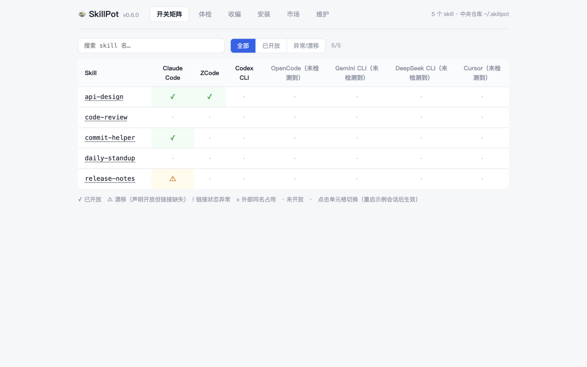
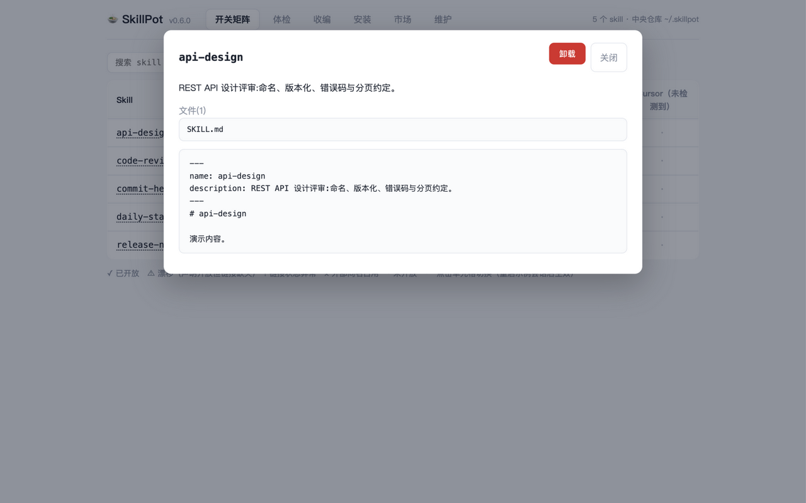
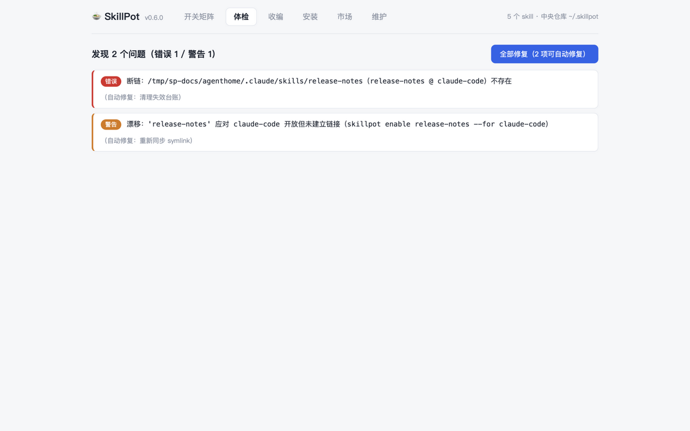
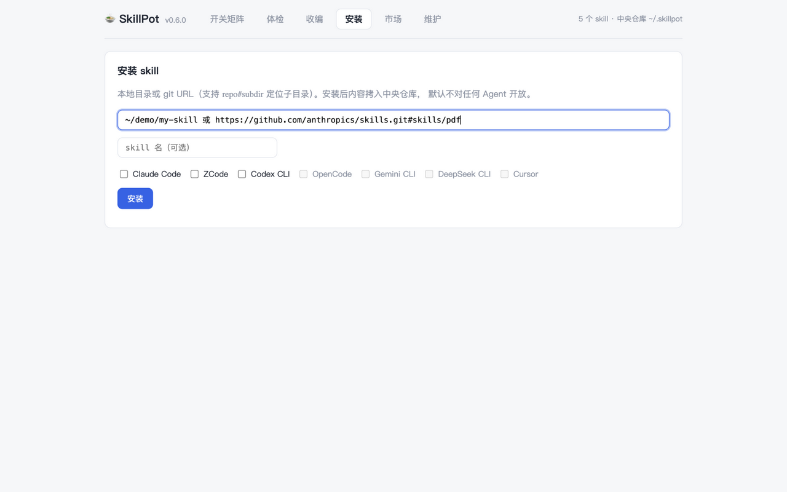
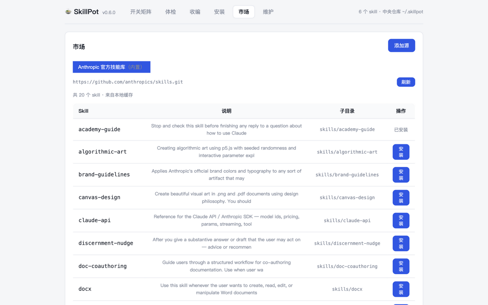
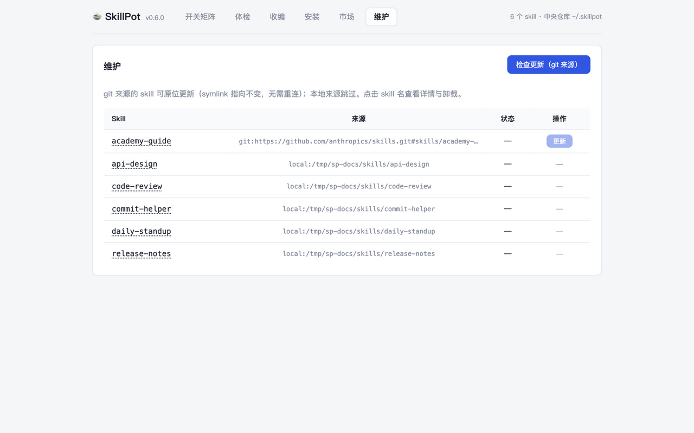
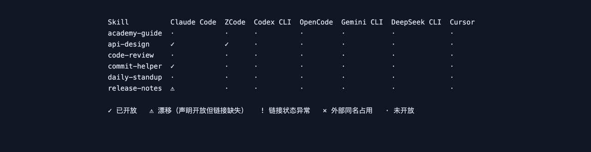

# SkillPot 功能指南

本文带你走一遍 SkillPot 的全部功能。所有截图来自演示环境(虚构的 skill 名)。

- 安装:`npm install -g @tec-explorer/skillpot`(或 `npx @tec-explorer/skillpot`,短别名 `spot`)
- 要求:Node ≥ 18
- 命令总览:`skillpot --help`

---

## 1. 初始化:一处收拢所有 skill

```bash
skillpot init
```

创建中央仓库 `~/.skillpot/`(唯一真身所在),自动检测本机安装的 Agent。仓库为空且检测到各 Agent 目录已有 skill 时,会交互式询问是否移入。

目录布局:

```
~/.skillpot/
├── skills/<name>/SKILL.md   # 中央仓库:唯一真身(自包含,symlink 已解引用)
├── config.yaml              # 来源/版本/校验和 + skill×Agent 开关矩阵
├── state.json               # 链接台账(卸载只动台账内文件)
└── skillspot.lock.json      # 机器可读快照(团队共享/审计)
```

## 2. 开关矩阵:一个界面管所有 Agent

```bash
skillpot gui     # 浏览器控制台(推荐)
spot tui         # 终端交互版
```

### GUI 开关矩阵

矩阵的**行是 skill,列是 Agent**。单元格五种状态:

| 符号 | 含义 |
|---|---|
| ✓(绿) | 已开放:Agent 目录里有指向中央仓库的受管 symlink |
| ⚠(黄) | 漂移:config 声明开放,但链接缺失(比如链接被手动删了) |
| !(黄/红) | 链接状态异常 |
| ×(红) | 外部同名占用:该位置有个不是 SkillPot 创建的同名条目,点击不生效 |
| ·(灰) | 未开放 |



- **点击单元格**即切换:开放 = 在该 Agent 的 skills 目录创建指向中央仓库的 symlink;关闭 = 撤下。切换后台灯提示结果,**Agent 重启示例会话后生效**。
- 顶部**搜索框**按名称过滤;**分段筛选**可只看「已开放」或「异常/漂移」的 skill——skill 一多时快速定位。
- 列头灰显 `(未检测到)` 表示本机没装该 Agent(仍可开放,但建议先安装)。
- 点击 **skill 名**打开详情。

### skill 详情

详情弹层展示描述、文件树、SKILL.md 原文与 lint 结论,并可**卸载**(撤下所有 Agent 链接 + 删除中央仓库内容,带确认)。



### 实时同步

任意写操作成功后,服务端通过 SSE 广播,所有打开的控制台标签页**自动刷新**——你在终端里用 CLI 做的收编/安装,GUI 会在下次数据变化后同步;多标签页之间保持一致。

### 安全模型

服务只监听 `127.0.0.1`;启动时生成随机 token,所有**写操作**必须携带(token 经首次访问地址 `?token=` 自动收进会话)。需要局域网访问时用 `skillpot gui --host 0.0.0.0`,届时读取也强制认证。

## 3. 体检:三方一致性自动诊断

```bash
skillpot doctor        # 只报告
skillpot doctor --fix  # 自动修复
```

体检覆盖:config 与中央仓库不一致、断链、台账漂移、孤儿链接、expose 漂移。GUI 中问题按 **错误/警告** 分级展示,可自动修复的项提供**一键「全部修复」**(等价 `--fix`:清理失效台账 + 重同步 symlink;需人工决策的项只提示不动手)。



上例:手工删掉了 `release-notes` 在 Claude Code 的链接,体检给出断链(错误)与漂移(警告)各一条,点「全部修复」即恢复一致。

## 4. 收编:把散落各处的 skill 移进中央仓库

```bash
skillpot adopt --dry-run   # 预览
skillpot adopt             # 拷贝收编,原目录保留
skillpot adopt --move      # 移动模式:原目录替换为 symlink
```

GUI「收编」Tab 自动扫描各已检测 Agent 目录下的真实 skill 目录(symlink 会跳过),**勾选式收编**,支持移动模式与"收编后开放给来源 Agent":


移动模式最适合"同一个 skill 在多个 Agent 目录各有一份"的场景:内容拷入中央仓库后,原目录替换为 symlink——所有 Agent 共用一份真身,后续更新一处完成。

## 5. 安装:本地目录或 git 仓库

```bash
skillpot add ~/demo/my-skill
skillpot add https://github.com/owner/skills.git#skills/pdf   # # 后定位仓库内子目录
```

GUI「安装」Tab 同样支持两种来源,并可勾选安装后立即对哪些 Agent 开放。安装即执行 **lint 安全扫描**(frontmatter 完整性 + 脚本高危模式如 `rm -rf`、`curl | sh`),结果直接展示:



## 6. 市场:从技能源浏览与一键安装

```bash
skillpot source list                 # 列出技能源
skillpot source add <url> [名称]      # 添加自定义源(git 仓库)
skillpot source remove <url>
skillpot market [url] [--refresh]    # 命令行浏览源内 skill
```

GUI「市场」Tab 内置 **Anthropic 官方技能库**(`anthropics/skills`),可添加任意自定义 git 源。选中源后列出其中全部 skill(名称/说明/仓库内子目录/已装标记),**一键安装**——安装走与「安装」Tab 相同的流程(lint、默认不开放),之后去矩阵打勾开放。



说明:

- 源仓库克隆缓存在 `~/.skillpot/cache/market/`,「刷新」按钮强制更新;
- 官方源中 `docx` / `pdf` / `pptx` / `xlsx` 四个文档技能为 source-available 许可(非开源),使用前请阅原仓库说明;
- 从 skills.sh 等目录站看到的 skill,只要它托管在 GitHub 上,同样可以用「安装」Tab 的 `owner/repo#子目录` 方式安装。

## 7. 更新与卸载:一处更新,安全下架

```bash
skillpot update            # 拉取 git 来源 skill 的最新内容,原位替换
skillpot update --check    # 只检查不应用
skillpot remove <skill>    # 撤下所有 Agent 链接 + 删除中央仓库内容
```

GUI「维护」Tab 汇总所有 skill 的来源:git 来源可**检查/应用更新**(symlink 指向不变,无需重连 Agent);点击 skill 名可查看详情并卸载。本地来源会明确标注跳过。



## 8. TUI:终端里的开关矩阵

```bash
spot tui
```

↑↓←→ 移动光标,空格切换开关,`a` 整行切换,`q` 退出;非 TTY 环境用 `spot tui --once` 输出静态矩阵(适合脚本/CI)。



## 9. MCP bridge:让 Agent 直接读中央仓库

```bash
skillpot mcp
```

零依赖 stdio MCP server,提供 `skillpot_list` / `skillpot_read` / `skillpot_search` 三个工具,遵循开关矩阵过滤(用 `SKILLPOT_AGENT=<agentId>` 指定视角)。任何支持 MCP 的 Agent 都能把 SkillPot 当作技能后端。

## 10. 命令速查

| 命令 | 说明 |
|---|---|
| `skillpot init` | 初始化中央仓库 + Agent 检测 |
| `skillpot agents [--json]` | 检测本机 Agent 及 skills 目录 |
| `skillpot add <source>` | 安装(本地目录 / git URL#subdir) |
| `skillpot list [--agent id]` | 列出仓库 skill 与开放状态 |
| `skillpot enable/disable <skill> --for <agents>` | 开关(agents 支持逗号分隔或 all) |
| `skillpot remove <skill>` | 卸载 |
| `skillpot adopt [--move] [--dry-run]` | 收编 |
| `skillpot lint [skill] [--strict]` | 安全/质量扫描 |
| `skillpot update [skill] [--check]` | git 来源更新 |
| `skillpot doctor [--fix]` | 体检与修复 |
| `skillpot gui [--port] [--host] [--no-open]` | Web 控制台 |
| `skillpot tui [--once]` | 终端开关矩阵 |
| `skillpot mcp` | MCP server(stdio) |
| `skillpot source list/add/remove` | 市场源管理 |
| `skillpot market [url]` | 浏览源内 skill |

## 11. 支持的 Agent

Claude Code、ZCode、Codex CLI、OpenCode、Gemini CLI、DeepSeek CLI(dsh)、Cursor,共七家。适配器 = 已确认的"用户级 skills 发现路径" + 二进制/目录指纹检测; welcoming 新 Agent:只要它扫描某个用户级目录下的 `SKILL.md` 目录,就能以约十行适配器接入(欢迎 PR)。

---

更多设计细节见 [README](../README.md) 与 [docs/](.) 下的设计文档。
